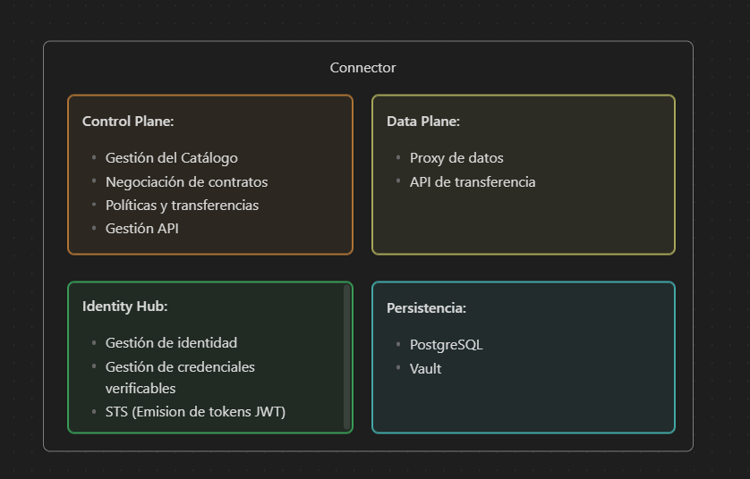

# Launchers

Este directorio contiene los lanzadores ("launchers") ejecutables del conector: **Control Plane**, **Data Plane** e **Identity Hub**, junto a servicios de soporte (**PostgreSQL** y **HashiCorp Vault**). La guía está pensada para arrancar el stack local sin conocer EDC a fondo y para entender los scripts clave de inicialización y registro de assets.

Índice rápido:
1. Resumen exprés
2. Requisitos
3. Construcción de JARs sombreado (shadow)
4. Configuración y material de identidad
5. Arranque con Docker Compose
6. Scripts disponibles (seed-local, store-vault-secret, create-circularpass.assets)
7. Verificación y primeras llamadas
8. Catálogo remoto y X-Api-Key opcional
9. Parada y limpieza
10. Arquitectura y puertos
11. Solución de problemas frecuentes

---

## 1. Resumen rápido (si tienes prisa)

1) Construir JARs: `./gradlew -Ppersistence=true :launchers:controlplane:shadowJar :launchers:dataplane:shadowJar :launchers:identity-hub:shadowJar`
2) Levantar stack: `cd launchers && docker compose up -d --build`
3) Seed inicial: `bash seed-local.sh`
4) Comprobar health: `curl http://localhost:9280/api/check/health`
5) Probar gestión: `curl -H "Authorization: Bearer password" http://localhost:9281/api/management/v3/assets`
6) Pedir catálogo (con o sin proxy X-Api-Key, según el provider)
7) Si aparece `401 Unauthorized`, sustituye VCs en `deployment/assets/credentials/` por las emitidas por el issuer del dataspace y repite el seed.

## 2. Requisitos

Necesitas antes de nada: Docker (Desktop o Engine) con Compose v2, JDK 17+, Bash y `curl`, puertos libres (`9280-9285`, `9181`, `9290`, `9480-9486`, `9200`, `9432`) y material DID/VCs en `deployment/assets/`.

## 3. Clonar el repositorio

- Descarga o clona el repo en tu equipo (Windows, macOS o Linux). En Windows con WSL o PowerShell funciona bien.
- A partir de aquí, todas las rutas se refieren a `EDC-Connector/launchers` salvo que se indique lo contrario.

## 4. Construir los JAR “sombreados” (shadow)

Cada Dockerfile copia un JAR sombreado desde `launchers/<runtime>/build/libs`. Genera/actualiza estos artefactos cuando cambies código o dependencias:

```bash
./gradlew -Ppersistence=true \
  :launchers:controlplane:shadowJar \
  :launchers:dataplane:shadowJar \
  :launchers:identity-hub:shadowJar
```


La propiedad `-Ppersistence=true` incluye las extensiones de PostgreSQL y HashiCorp Vault usadas por la configuración que se entrega. Omitirla solo tiene sentido si has desactivado conscientemente esos servicios.

> Consejo: Gradle hará “up-to-date” si nada cambió, así que puedes ejecutar este paso siempre sin pagar todo el coste del build.

## 5. Revisar identidades, credenciales y participantes

La pila de Compose monta la configuración y el material de credenciales desde el repo. Revisa y alinea:

- `launchers/controlplane/configuration.properties` - DID del conector (`edc.participant.id`), callback DSP, credenciales de Vault/DB, token de gestión, etc.
- `launchers/dataplane/configuration.properties` - puertos del dataplane, endpoint de registro del selector (`edc.dpf.selector.url`), alias de claves para firmar/verificar tokens de proxy.
- `launchers/identity-hub/configuration.properties` - DID del hub, API key de superusuario, endpoints de Vault/DB y rutas a credenciales.
- `deployment/assets/public.pem` / `private.pem` y `deployment/assets/credentials/*` - par de claves DID y VCs.
- `deployment/assets/participants/participants.local.json` - (opcional) mapa DID -> endpoint a resolver por el Control Plane.

Todas las piezas deben ser consistentes: el DID configurado en controlplane, dataplane e identity-hub debe corresponder con las claves/VCs montadas. Si no, tendrás reinicios/errores de validación.

Notas prácticas:
- Los servicios se resuelven mediante DNS de Docker (edc-controlplane, edc-identity-hub, edc-dataplane); con�ctalos a la misma red que el dataspace.
- Este repo NO incluye un servicio de emisión (issuer). Las VCs de `deployment/assets/credentials` son de ejemplo; para escenarios reales pide credenciales al issuer del dataspace y colócalas ahí.

### ¿Dónde encuentro endpoints y claves?

- Gestión del Control Plane: `launchers/controlplane/configuration.properties`
  - URL: `http://localhost:9281/api/management` (según `web.http.management.port/path`)
  - Token: `password` (según `web.http.management.auth.key`)
- DSP del Control Plane (entrante/saliente): `http://localhost:9282/api/dsp`
  - Propiedad de callback: `edc.dsp.callback.address`
- STS/Identity Hub: `launchers/controlplane/configuration.properties`
  - `edc.iam.sts.oauth.token.url` → normalmente `http://identity-hub:8286/api/sts/token`
  - `edc.iam.sts.oauth.client.id` → tu DID
  - `edc.iam.sts.oauth.client.secret.alias` → alias en Vault (ver seed)
- Identity Hub (APIs): base `http://localhost:9480/api`, identity `:9482`, credentials `:9481`, did `:9483`, version `:9485`, sts `:9486`

## 6. Arranque con Docker Compose (recomendado)

Desde la carpeta `launchers/` construye las imágenes y arranca servicios:

```bash
cd launchers
docker compose build
docker compose up -d
```

Si falla `docker compose build` por falta de JARs, repite el paso 1. La pila levanta: controlplane, dataplane, identity-hub, PostgreSQL y Vault, todos en la misma red para resolverse por nombre de servicio (`controlplane`, `dataplane`, `identity-hub`, `postgres`, `vault`).

> Si solo cambiaste ficheros de configuración, puedes usar `docker compose up -d --build` para reconstruir sin pasar por Gradle manualmente.

## 7. (Opcional) Construir imágenes con Gradle (`dockerize`)

Este repo define una tarea `dockerize` por launcher (se crea automáticamente si hay `shadowJar` y `src/main/docker/Dockerfile`, ver `build.gradle.kts: subprojects { afterEvaluate { ... dockerize ... } }`). Sirve para preconstruir imágenes desde Gradle y etiquetarlas con `latest` y la versión del proyecto.

Comandos típicos:

```bash
./gradlew -Ppersistence=true \
  :launchers:controlplane:dockerize \
  :launchers:dataplane:dockerize \
  :launchers:identity-hub:dockerize
```

Si necesitas construir para otra plataforma (por ejemplo, `linux/amd64`):

```bash
./gradlew :launchers:controlplane:dockerize -Dplatform=linux/amd64
```

Importante sobre las etiquetas: `dockerize` genera imágenes `controlplane:latest`, `dataplane:latest`, `identity-hub:latest`. El `docker-compose.yml` usa `edc-controlplane:latest`, `edc-dataplane:latest`, `edc-identity-hub:latest`. Opciones:

- Retag antes de levantar Compose:

```bash
docker tag controlplane:latest edc-controlplane:latest
docker tag dataplane:latest edc-dataplane:latest
docker tag identity-hub:latest edc-identity-hub:latest
```

- O simplemente usa `docker compose up -d --build` y deja que Compose construya/etiquete con los nombres esperados. En la práctica, usar Compose (paso 3) es suficiente y no necesitas `dockerize` salvo que quieras publicar/gestionar imágenes con Gradle.

## 8. Scripts disponibles y flujo inicial

### 8.1 `seed-local.sh`
Inicializa el entorno tras el primer arranque o tras limpiar volúmenes:
* Guarda API key de superusuario y clave privada DID en Vault (alias `key-1`).
* Registra el participante en el Identity Hub.
* Publica/activa DID (si los endpoints están soportados).
* Persiste el `clientSecret` del STS como `<DID>-sts-client-secret`.

Uso mínimo:
```bash
cd launchers
bash seed-local.sh
```
Sobrescribir variables:
```bash
export PARTICIPANT_DID="did:web:edc-identity-hub%3A8283"
export SUPERUSER_API_KEY="base64.superuser.key"
export STS_SECRET_VALUE="change-me"
bash seed-local.sh
```

### 8.2 `store-vault-secret.sh`
Helper para escribir/rotar un secreto bajo `secret/<nombre>` con campo `content` (KV v2). Útil para bearer tokens o API Keys referenciados por assets `HttpData` vía `secretName`.

```bash
VAULT_ADDR=http://localhost:9200 \
VAULT_TOKEN=root \
SECRET_NAME=secure-api \
SECRET_VALUE="Bearer eyJ..." \
./store-vault-secret.sh
```
Verificación:
```bash
curl -s -H "X-Vault-Token: root" http://localhost:9200/v1/secret/data/secure-api | jq -r '.data.data.content'
docker exec edc-vault sh -lc 'VAULT_ADDR=http://127.0.0.1:8200 VAULT_TOKEN=root vault kv get -format=json secret/secure-api' | jq -r '.data.data.content'
```
Rotación = reejecutar con nuevo `SECRET_VALUE`.

### 8.3 `create-circularpass.assets.sh`
Registra un asset `HttpData` + policy + contract definition para exponer una API protegida cuyo token vive en Vault (secretName). Variables principales:

| Variable | Significado | Default |
|----------|-------------|---------|
| BASE_URL | URL base de la Management API (sin sufijo /api/management/v3) | http://localhost:9281 |
| MGMT_TOKEN | Token Bearer configurado en `web.http.management.auth.key` | password |
| ASSET_ID | ID lógico del asset | asset-secure-endpoint |
| ASSET_BASE_URL | Backend protegido (base URL) | https://api.circularpass.io/api/secure/v1/instances |
| SECRET_NAME | Nombre del secreto en Vault | secure-api |
| POLICY_ID | ID de la policy | require-membership |
| CONTRACT_DEF_ID | ID contract definition | secure-asset-membership-required-def |

Ejemplo:
```bash
MGMT_TOKEN=password \
ASSET_BASE_URL=https://api.circularpass.io/api/secure/v1/instances \
SECRET_NAME=secure-api \
./create-circularpass.assets.sh
```
Después puedes listar assets:
```bash
curl -H "Authorization: Bearer password" http://localhost:9281/api/management/v3/assets
```

## 9. Verificación rápida

Cuando los contenedores estén en marcha, ejecuta el script de seed para almacenar secretos en Vault y registrar el participante en el Identity Hub:

```bash
cd launchers
bash seed-local.sh
```

El script:

- guarda la API key de superusuario (`SUPERUSER_API_KEY`) y el secreto de STS (`STS_SECRET_VALUE`) en el contenedor `edc-vault` bajo claves KV con el campo `content`;
- registra el participante en el Hub (si ya existe verás “already exists”);
- intenta activarlo/publicar el DID (si el Hub no soporta esos endpoints verás 405/500 y continúa);
- crea/actualiza el `clientSecret` en Vault con el alias `did:web:edc-identity-hub%3A8283-sts-client-secret`.

Variables que puedes sobreescribir antes de ejecutar:

```bash
export PARTICIPANT_DID="did:web:edc-identity-hub%3A8283"
export SUPERUSER_API_KEY="base64.superuser.key"
export STS_SECRET_VALUE="change-me"
bash seed-local.sh
```

Repite el seed si rotas credenciales o tras `docker compose down -v`.

### Health y gestión

Comprueba salud de servicios:

```bash
docker compose ps
curl http://localhost:9280/api/check/health     # controlplane
curl http://localhost:9181/api/check/health     # dataplane
curl http://localhost:9480/api/check/health     # identity hub
```

Prueba la API de gestión (token `password`):

```bash
curl -X POST http://localhost:9281/api/management/v3/assets \
  -H "Content-Type: application/json" \
  -H "Authorization: Bearer password" \
  -d '{
        "asset": { "properties": { "asset:prop:id": "asset-1" } },
        "dataAddress": { "type": "HttpData", "baseUrl": "https://httpbin.org/anything" }
      }'
```

Si devuelve `201`, el controlplane está listo para llamadas de gestión.

## 10. Pedir catálogo al proveedor (ejemplo)

Lanza un `CatalogRequest` al DSP del proveedor. Ejemplo con curl (token de gestión `password`):

```bash
curl -sS -X POST http://localhost:9281/api/management/v3/catalog/request \
  -H 'Authorization: Bearer password' \
  -H 'Content-Type: application/json' \
  -d '{
        "@context": ["https://w3id.org/edc/connector/management/v0.0.1"],
        "@type": "CatalogRequest",
        "counterPartyAddress": "http://edc-controlplane:8282/api/dsp",
        "counterPartyId": "did:web:provider-identityhub%3A7093",
        "protocol": "dataspace-protocol-http",
        "querySpec": { "offset": 0, "limit": 50 }
      }'
```

Posibles respuestas:
- `502/JWSSigner ... not found` → falta la clave/secret en Vault. Ejecuta `./seed-local.sh` y verifica que existe:
  `docker exec edc-vault sh -lc 'VAULT_ADDR=http://127.0.0.1:8200 VAULT_TOKEN=root vault kv get secret/did:web:edc-identity-hub%3A8283-sts-client-secret'`.
- `{"message":"x-api-key not found"}` → el provider exige la cabecera `X-Api-Key`. Añádela con un proxy (ver “Cabecera X-Api-Key” abajo).
- `dspace:code=401/Unauthorized` → el provider exige VCs válidas (membership/dataprocessor) emitidas por su issuer para tu DID. Sustituye las VCs de `deployment/assets/credentials` por las oficiales y ejecuta `./seed-local.sh`.

### Cabecera X-Api-Key (rápido con Nginx)

Si el provider requiere `X-Api-Key`, arranca un proxy que la inyecte:

```nginx
server {
  listen 9822;
  location /api/dsp {
    proxy_set_header X-Api-Key password;
    proxy_pass http://provider-controlplane:8082;
  }
}
```

```bash
docker run -d --name edc-dsp-proxy -p 9822:80 \
  -v $(pwd)/default.conf:/etc/nginx/conf.d/default.conf:ro nginx:1.27
```

Usa `counterPartyAddress": "http://edc-controlplane:8282/api/dsp"` en el body del request.

## 11. Parada y limpieza

```bash
docker compose down          # para contenedores y conserva volúmenes
docker compose down -v       # para y borra datos de PostgreSQL/Vault
```

Usa `docker compose logs -f <servicio>` para diagnosticar arranques. Si un contenedor falla por "No such file" al lanzar el JAR, reconstruye los shadow JARs (paso 1).

---

## 12. Componentes y Arquitectura



- Control Plane
  - Orquesta negociación de contratos (DSP), catálogo, políticas y transferencias.
  - Expone APIs: base/health (`9280`), gestión (`9281`), protocolo DSP (`9282`), control/selector (`9283`), catálogo (`9284`), versión (`9285`). Mapeo host:contenedor según `docker-compose.yml`.
  - Usa PostgreSQL para persistencia y Vault para secretos.

- Data Plane
  - Proxy sin estado que mueve datos entre origen y destino durante una transferencia autorizada.
  - APIs: REST interna (`9181->8080`) y pública de transferencia (`9290->8290`). Se registra en el Control Plane vía Data Plane Selector (`edc.dpf.selector.url`).

- Identity Hub
  - Gestiona DIDs, credenciales verificables y STS (Secure Token Service) necesarios para autenticación entre participantes y servicios.
  - APIs publicadas en `9480-9486` (base, credentials, identity, did, version, sts).
  - Usa PostgreSQL y Vault; espera claves/VCs bajo `deployment/assets/`.

- Vault y PostgreSQL
  - Vault (modo dev) almacena secretos; el script de seed escribe bajo `secret/<clave>` con valor en el campo `content`.
  - PostgreSQL persiste estados del conector/hub/dataplane. Volumen `pgdata` mantiene datos entre arranques.

### Flujo de arranque (resumen)

1) Arrancan `postgres` (hasta healthy) y `vault`.
2) `controlplane` inicia y queda healthy (requiere DB/Vault).
3) `dataplane` arranca y se registra en el selector del controlplane.
4) `identity-hub` arranca, tras lo cual ejecutas `seed-local.sh` para registrar el participante y publicar su DID.

### Puertos relevantes (host -> contenedor)

- Control Plane: `9280->8280`, `9281->8281`, `9282->8282`, `9283->8283`, `9284->8284`, `9285->8285`
- Data Plane: `9181->8080` (API interna), `9290->8290` (API pública)
- Identity Hub: `9480->8080`, `9481->8281`, `9482->8282`, `9483->8283`, `9485->8285`, `9486->8286`
- Vault: `9200->8200` | PostgreSQL: `9432->5432`

---


## 13. Tabla de puertos y contextos

| Servicio | Host Portes | Contenedor | Contextos HTTP internos |
|----------|-------------|-----------|-------------------------|
| Control Plane | 9280-9285 | 8280-8285 | /api (health), /api/management, /api/dsp, /api/control, /api/catalog, /api/version |
| Data Plane | 9181, 9290 | 8080, 8290 | /api (health), /api/public, /api/control (interno 9191) |
| Identity Hub | 9480-9486 | 8080, 8281-8286 | /api base + identity/credentials/did/version/sts |
| Vault | 9200 | 8200 | /v1/secret/... |
| PostgreSQL | 9432 | 5432 | JDBC edc |

## 14. Solución de problemas frecuentes

- “Using the InMemoryVault ...” y errores con STS
  - Asegúrate de construir con `-Ppersistence=true` (paso 1).
  - Ejecuta `./seed-local.sh` tras cada `up --build` (Vault en dev se vacía si recreas contenedores).
  - Comprueba que `controlplane/configuration.properties` incluye:
    - `edc.iam.sts.privatekey.alias=key-1`
    - `edc.iam.sts.publickey.id=did:web:edc-identity-hub%3A8283#key-1`
- “JWSSigner cannot be generated ... private key ... not found”
  - Carga la clave privada en Vault con alias `key-1` (el seed ya lo hace) y repite el seed.
- `x-api-key not found`
  - El provider exige la cabecera en su DSP. Usa el proxy Nginx o integra la cabecera en tu entorno.
- `401 Unauthorized (dspace:CatalogError)`
  - El provider exige VCs válidas para tu DID. Sustituye las VCs de ejemplo por las emitidas por su issuer y repite `./seed-local.sh`.

## 15. Referencias internas

Directorio de ejemplos y variantes:
* `dpf-selector/` – variantes de selector/registro del dataplane.
* `generic/` – runtime genérico de demostración.
* `sts-server/` – componentes relacionados con STS.

Guías adicionales en el root del repositorio:
* `docs/http-assets-bearer-guide.md` – Detalle de assets HttpData con bearer y `secretName`.
* `docs/developer/*` – Decision records y notas técnicas.

---

¿Mejoras futuras sugeridas?
* Wrapper para comprobación de todos los health endpoints.
* Script de rotación periódica de bearer tokens.
* Ejemplos adicionales para `authCode` vs `secretName`.


